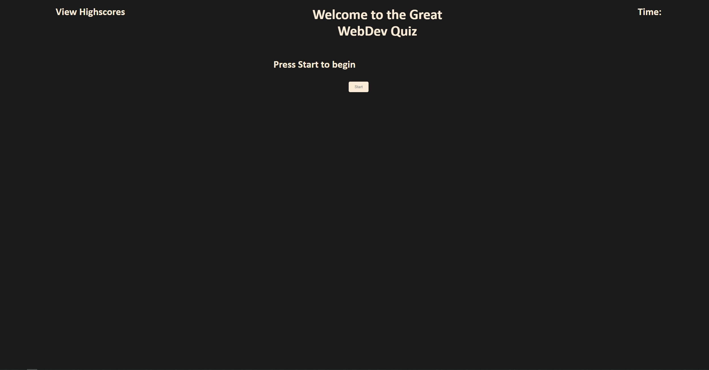
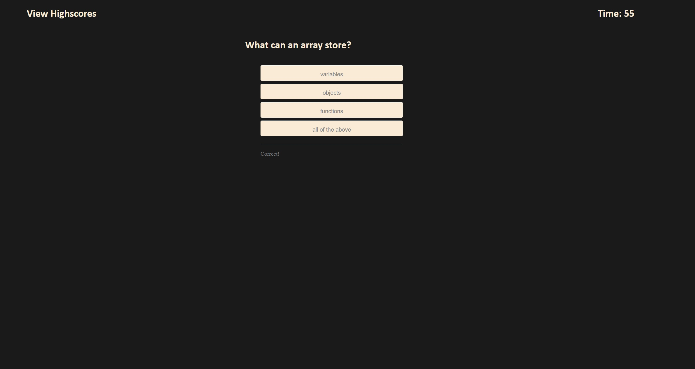
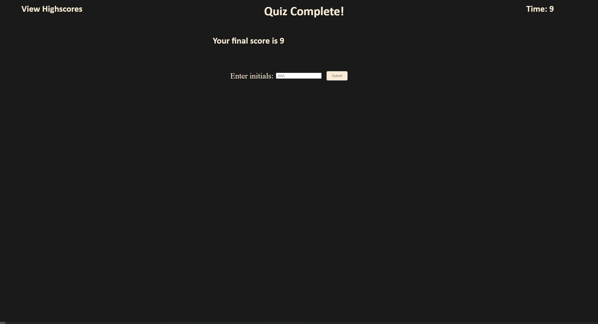

# Javascript Quiz(Now in Javascript flavour)

## Description

the purpose of this application is to both test both the user and the creator's knowledge and mastery with Javascript. Attached to this repository is an app which queries the user with up to ten skill-testing questions relating to Javascript and its varying nuances. The user is given a set time limit of 75 seconds to complete the questionnaire, with incorrect questions docking their time limit by 10 seconds each. Users unable to complete the quiz in time are given zero points, with one point being given for each remaining second after the quiz is complete.

Users who complete the quiz are given the option to enter their initials and have their score recorded for later comparison. This however is done locally within the browser, so comparing your score against others online is sadly unavailable at the time.

## Installation

N/A

## Usage

Attached to this Github and [linked here]() are portals to the site in question.
To start the quiz, click the button in the center of the screen labelled Start

Afterwards, you'll be given multiple choice questions with a number of choices to pick, so choose wisely

Once you've completed the quiz, feel free to enter your initials to locally save your score to compare against later

## Credits

All attached images were provided by the client and used with their permission.

## License

Please refer to the LICENSE file attached to this repo for further information.